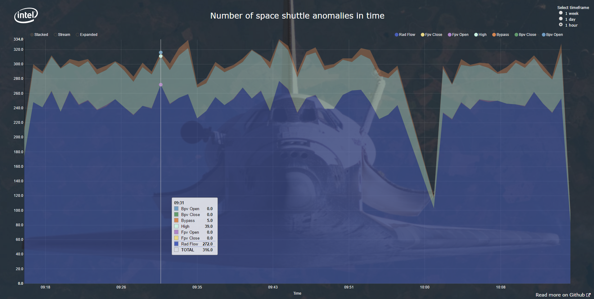

[a75eded2]: https://github.com/trustedanalytics-ng/tap-cli "tap-cli documentation"


# space-shuttle-demo
This page provides instructions for using the Analytics Toolkit space shuttle demo application. The default version of this application uses Gateway and Kafka as streaming sources. Currently, application doesn't support mqtt.

## Overview


### Implementation summary
#### Scoring flow:
* The space-shuttle-demo application listens to the Kafka topic and waits for feature vectors.
* When a Kafka message appears, the application asks the Scoring Engine to classify the received feature vector.
* The application stores the scoring result in an InfluxDB database.

#### Generating graph flow:
* The web application asks the backend application (space-shuttle-demo) for an anomalies chart.
* The space-shuttle-demo application fetches anomalies (classes different than 1) several times per minute from InfluxDB and then displays them.

## Deploying application to TAP
To upload sample application 'space-shuttle-demo' to Platform you can use bash script *deploy.sh* (is located in *deploy/* folder). This script create needed services, upload application to platform and create bindings. If you want to upload application and create other service manually, you can use *TAP CLI*.  

**What I need?**
* TAP CLI - TAP CLI is a command line client for TAP. For more information visit [tap-cli documentation][a75eded2]
  > You can download this tool from your TAP Instance (on TAP, please go to tab *App Development*)

* Application package:
  * Download source code of demo application, go to *space-shuttle-demo/* folder and then run command in this location to build app:
    `mvn package`
  * Rename built app to *space-shuttle-demo.jar* from *space-shuttle-demo-<version_number>.jar*. This file is located in *target/* folder.
    `mv <old_name> <new_name>`

  * Create a *manifest.json*

    ```
    {
      "type":"JAVA",
      "name":"space-shuttle-demo",
      "instances":1,
      "bindings":[
        "space-shuttle-gateway",
        "space-shuttle-db",
        "space-shuttle-scoring-engine"
      ]
    }
    ```

  * Create *run.sh*
    ```
    #!/usr/bin/env bash

    java -jar space-shuttle-demo.jar --server.port=80 --spring.profiles.active=kafka-input,web-scoring,influx-storage
    ```
  * Pack *run.sh* and *space-shuttle-demo.jar* into *space-shuttle-demo.tar.gz*
  * Into the same folder, where *space-shuttle-demo.tar.gz* is stored (it should be located in *target*), please copy *manifest.json*, download model from https://s3.amazonaws.com/trustedanalytics/v0.7.4/models/spaceshuttleSVMmodel.mar and save as *model.mar*
  * You application package is complete
  ```
  <work-folder/>
  |-- manifest.json
  |-- model.mar
  |-- space-shuttle-demo.tar.gz
        |-- run.sh
        |-- space-shuttle-demo.jar
  ```

    You can make another folder (ex. *work-folder/*) to store there, all needed files for deployment.

    ```
    <work-folder>
    |-- tap-cli
    |-- deploy.sh
    |-- manifest.json
    |-- model.mar
    |-- space-shuttle-demo.tar.gz
          |-- run.sh
          |-- space-shuttle-demo.jar
    ```

### Automatic deployment
**How it works**:
This script deploy sample application 'space-shuttle-demo' to Trusted Analytics
Platform (TAP) using TAP CLI (Command Line Interface).

**Params:**
`$1 - path to tap-cli directory`

**How to run:**
* Login to TAP instance using TAP CLI:

    `./<path-to-tap>/tap login --api <http://-https://-instance-address> --username <username> --password <password>`

* Run *deploy.sh* script:
  `./deploy.sh <path_to_tap_cli_directory> E.g.: ./deploy.sh /home/centos/TAP-0.8`


### Manual deployment
**How to create needed services and push application manually:**
* Login to TAP instance using TAP CLI:
    `./<path-to-tap>/tap login --api http(s)://api.<instance-address> --username <username> --password <password>`

* Create needed service (influxdb, gateway and scoring-engine):
    *This step can be done automatically by deploy.sh script*

    `./<path-to-tap>/tap service create --offering gateway --plan single --name space-shuttle-gateway`

    `./<path-to-tap>/tap service create --offering influxdb-088 --plan single-small --name space-shuttle-db`

    `./<path-to-tap>/tap service create --offering scoring-engine --plan single --name space-shuttle-scoring-engine`

* Push model to space-shuttle-scoring-engine servie:
    *This step can be done automatically by deploy.sh script*

    `curl -X POST --data-binary @model.mar http://space-shuttle-scoring-engine.<domain>/uploadMarBytes`

* Push application to TAP Platform
    *This step can be done automatically by deploy.sh script*
    * run this in main directory of space-shuttle-demo application:
    `./<path-to-tap>/tap application push --archive-path space-shuttle-demo.tar.gz`

* Push client to TAP Platform
    *This step can be done automatically by deploy.sh script*
  * go to *client* directory and then run:
    `./<path-to-tap>/tap application push`

* Now, your demo application should show up at `http://space-shuttle-demo.<your-TAP-instance.com>`


However, this contains dummy data (mocked data). If you want, you can train a new model, or upload another one prepared by Intel. To do this use the steps below:

### FAQ
#### What if on instance there's another space-shuttle-demo?
If you want to install another demo application, you should change name of service (in *deploy.sh* script), bindings in *manifest.json* and names in *manifest.json* and *run.sh*.  

#### Upload the model to HDFS:
   * Download the pre-packaged model from: [https://s3.amazonaws.com/trustedanalytics/v0.7.1/models/space-shuttle-model.tar](https://s3.amazonaws.com/trustedanalytics/v0.7.1/models/space-shuttle-model.tar)
   * Login to the TAP console and navigate to  **Data catalog > Submit Transfer**.
   * Select input type: **Local path** and choose the previously downloaded model.
   * Enter a title in the **Title** field.
   * Click the **Upload** button.

   Alternatively, you can create the TAP Analytics Toolkit model yourself. Refer to the [instructions](#creating-tap-analytics-toolkit-model) later on this page.

#### Create required service instance
* Create the required service instances of **Scoring Engine** with recommended name: `space-shuttle-scoring-engine`.

    **How to create Scoring Engine**
    * To create the Scoring Engine service instance:
      * From the TAP console, navigate to **Services > Marketplace**. Select the “TAP Scoring Engine” service.
      * Type the name `space-shuttle-scoring-engine`
      * Click the **Create new instance** button.
      * When instance will be running then push model to space-shuttle-scoring-engine service: `curl -X POST --data-binary @model.mar http://space-shuttle-scoring-engine.{domain}/uploadMarBytes`

    **How to create and bind Scoring Engine using TAP CLI**
    * To create the Scoring Engine service instance:
    *
      `./<path-to-tap>/tap service create --offering scoring-engine --plan single --name space-shuttle-scoring-engine`
    * Bind source instance (by name) to target instance (by name). This step in needed to achieve communication between demo application and scoring engine (in this same way you can, another services).
    *
      `./<path-to-tap>/tap bind <src_instance_name> <dst_instance_name>`

* The application is now up and running. You should see the space shuttle image appear followed by anomaly data being displayed.

## Sending data to Kafka

To send data to Kafka through a gateway you can either (1) push space_shuttle_client from the client directory to the space with the existing gateway instance or (2) use the Python file ‘space_shuttle_client.py’, locally passing the Gateway url as a parameter.

## Local development
The application can be run in different configurations:
 * ```random-input``` or ```kafka-input``` - use random input, if you would like to get randomly generated input data,
 * ```random-scoring``` or ```web-scoring``` - use random scoring, if you would like to get random results from scoring engine (50% for being or not being an anomaly),
 * ```null-storage``` or ```influx-storage``` - use null storage (not recommended), if you want to use null storage (all data is destroyed, null returned for all reads).

>This can be changed by modifying *run.sh*

### Local Configuration
#### Prerequisites
##### InfluxDB
1. Instructions to install and run InfluxDB are provided here: http://influxdb.com/docs/v0.8/introduction/installation.html
1. The easiest way is to run InfluxDB is in inside a docker container: docker run -d -p 8083:8083 -p 8086:8086 tutum/influxdb:0.8.8.

>Note: influxdb:0.9 is *not* backwards compatible with 0.8.x.


##### Scoring Engine
For instructions on pushing the scoring engine to the platform, go [here](https://github.com/trustedanalytics/space-shuttle-demo#manual-deployment).


#### Run
1. Make sure that both proper profile are active.
1. ‘mvn spring-boot:run’
1. In a web browser, enter ‘localhost:8090’
